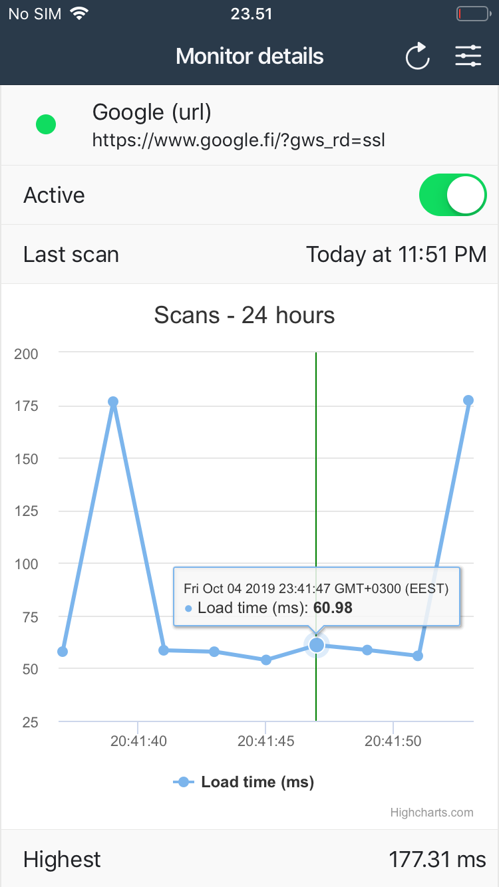

***

# AdminLabs Mobile - Website Monitoring

Mobile application for [AdminLabs](https://www.adminlabs.com/) services. App interacts with this [API](https://api.adminlabs.com/docs/#account).

Built with  
* [Ionic 4](https://ionicframework.com/)
* [Angular 7](https://angular.io/)

3rd. party dependencies :blue_book:
* [Highcharts](https://www.highcharts.com/)
* [Moment.js](https://momentjs.com/)
* [Crypto.JS](https://www.npmjs.com/package/crypto-js)
* [ngx-avatar](https://www.npmjs.com/package/ngx-avatar)

# Main features

## :closed_lock_with_key: Authentication 

**Login**
 * Save login credentials to device local storage, (AES Encrypted)
 * Use credentials in all HTTP requests of application
  
**Logout**
 * Remove user credentials from local storage
 
**Forgot password**
 * Request new password with login email address

## :chart_with_downwards_trend: Website monitoring

**Monitors page (List monitors)**
 * Monitor name
 * Health (Up/Warning/Down)
 * State (Enabled/Paused)
 * Monitoring URL
 * Link to monitor details page
 * Sort monitors by monitor groups
 * Sort monitors by health or state

**Monitor page (Monitor details)**
 * Monitor name
 * Health
 * Scan interval
 * Last scan
 * Monitoring state (Enabled/Paused) - Toggleable ON/OFF
 * Chart by loadtime (24h/7d/30d) & Steps 24-500
 * Loadtimes (Average/Max/Min)
  
  
## :wrench: Settings

**Notifications**
 * Toggle up/down notifications
 * Toggle down reminders
 
 
## Screenshots

